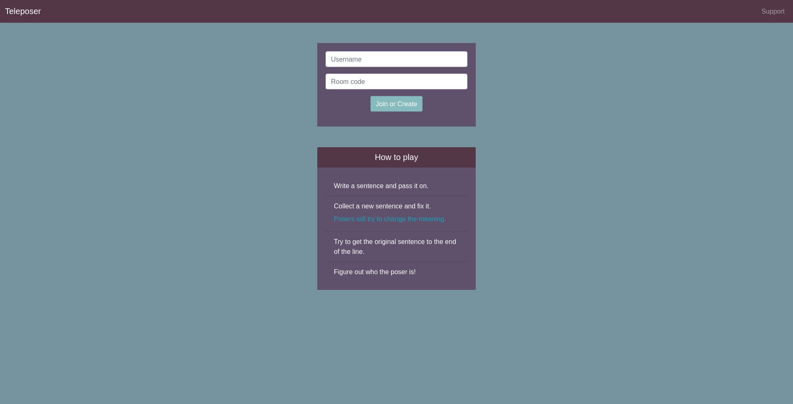

# Teleposer
A multiplayer browser game for writing sentences and passing them down the line.
Think broken-picturephone but with words and a poser whose job is to secretly
corrupt sentences.

## Deployment
Designed to be deployable on heroku. Current game is deployed 
[here](https://imposter-telephone.herokuapp.com/).

### TODO
* Fix table format
* Formatting screen size
* Add room code to player list
* Add topics phase?
* ignore caps in room code
